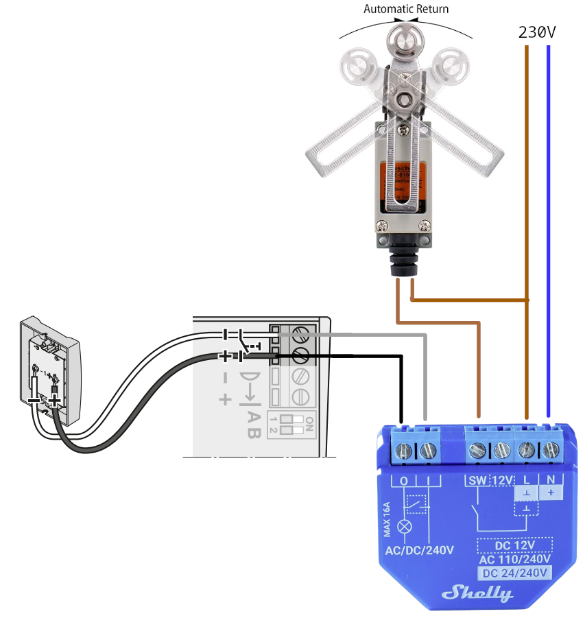
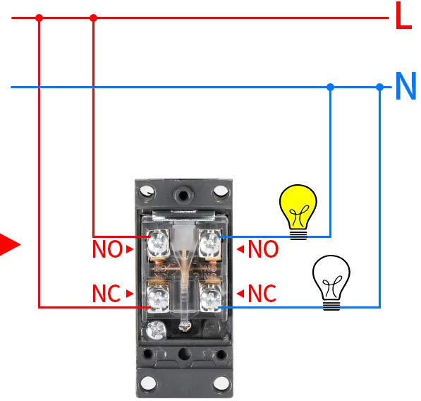
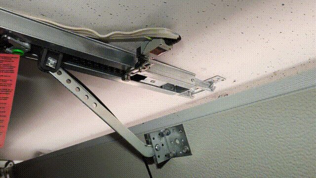
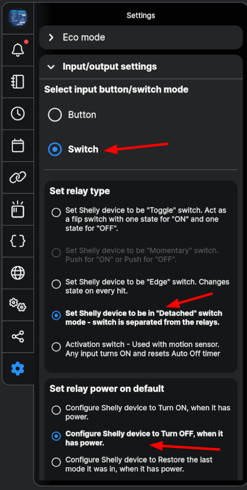
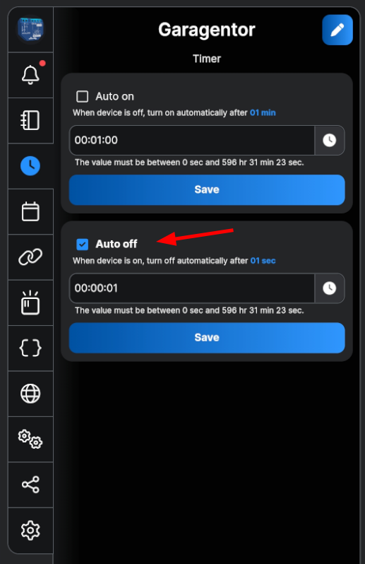
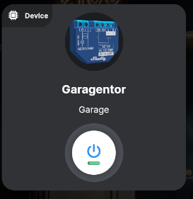

# Control your garage door and see if it is closed

TLDR: Use a Shelly Plus 1 to remote control your garage door and see if it is closed.

Problem: Having kids means that each evening you have to walk in front of the house to check if the garage door is really closed. 
It also means that you sometimes can't enter the garage because the kids took the remote with them on their bike trip.

I needed a solution to make my live easier.

Stuff to buy:
- Shelly 1 Plus
- [Heschen - Endschalter, Z-8/108 Verstellbarer Rollenhebel](https://www.amazon.de/dp/B072P28QLL)
- Cables for 230V and 24V

Stuff that I have to work with:
- EcoStar Liftronic 700 Garagentorantrieb

## Wiring

- Connect the Shelly to 230V on L and N
- Connect O/I to the +/- of the EcoStar Liftronic 700 parallel to the wall switch
- Connect L to the end switch (on NO = normally open) and back to the SW input of the shelly

> My end switch is open when the garage door is closed. 
> And I want the Shelly app to show "green/on" when the garage door is closed.
> Connecting the wires to NO (normally open) achieves that.

## Shelly configuration

- Switch mode
- Relay type: Detached
- Relay power on: OFF

- Set up an action that switches the relay off after 1s after turning on (so that the garage door only gets a short impulse)

- Enable input indicator in Shelly app

## Shelly Script

I want to get a notification if the garage door is still open after a certain time (e.g. 10pm). For the notification to 
my phone the service [Pushover](https://pushover.net/) is used.

- [Link to Shelly Script](./alert-when-open.js)