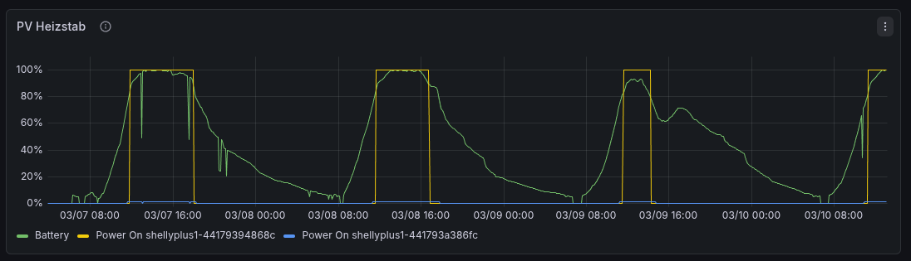

# Turn heating rod on/off based on battery level

The script pv-heat.js can be executed on a Shelly Plus1. It will monitor the battery level by calling the stats endpoint of a LG RESU10H BMS battery.
The goal is to only enable the electric heating if enough power is available in the battery. 
The script turns on the heating rod if the battery level is above a certain percentage level (which changes based on the current time).
The expectation is that it is ok in the morning to use the last 30% of the battery because the solar panels will charge the battery soon.
In the evening and night the battery will not be charged. In order to have enough power for the overnight period the power rod will
be turned off when the battery percentage drops below 80%. These values can be adjusted in summer when the nights are shorter.
This way it is possible to use excess solar power to heat water without risking to drain the battery too much.

- [Link to Shelly Script](./pv-heat.js)

## Monitoring

If you have Grafana and InfluxDb already setup you only need to set the influxdb connection in the script and the
current battery level and if the heating rod is turned of or on will be reported to InfluxDb. You can then use Grafana to visualize the power usage over time.

## Security hint

The call to influxdb is set to accept any ssl certificate with this `ssl_ca: "*"` parameter. The shelly didn't like the
LetsEncrypt certificate the influxdb was using. 