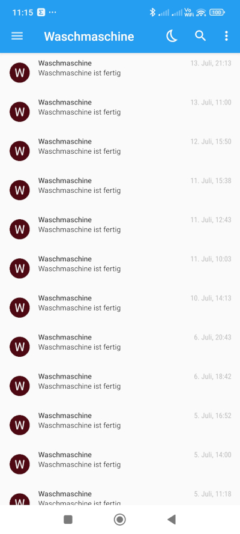
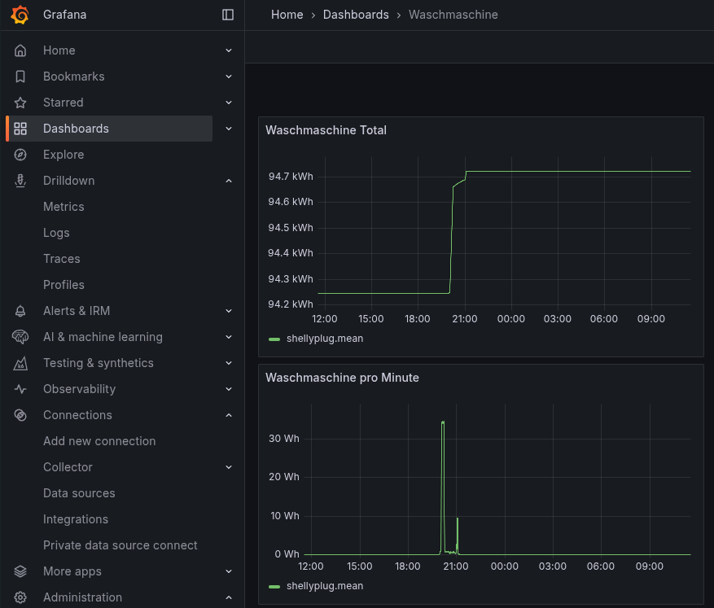

# Get notified when washing machine is done

The script notify-wash-done.js can be executed on a Shelly Plug S. It will monitor the power usage of the attached device
and send a notification once the device doesn't use any power anymore (over 3 minutes). I use it to get a notification on my phone once
the washing machine is done. The notification is implemented via [Pushover](https://pushover.net/). 

- [Link to Shelly Script](./notify-wash-done.js)

This is how a notification looks like on the phone:

## Monitoring

If you have Grafana and InfluxDb already setup you only need to set the influxdb connection in the script and the
power usage of the washing machine will be reported to InfluxDb. You can then use Grafana to visualize the power usage over time.

